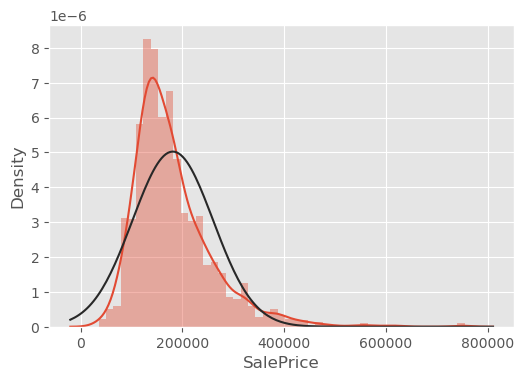

# Data analysis and implementation of ML models
Competition - [House Prices - Advanced Regression Techniques](https://www.kaggle.com/c/house-prices-advanced-regression-techniques/overview)
Done:
- Data preprocessing

- Feature engineering
- Models training: RandomForest, XGBoost, LGBM, Catboost
- Hyperparameters tuning with Optuna

- Feature analysis with a 'Feature importances' and 'Permutation importances'

- Clustering with a KMeans, AgglomerativeClustering algorithm and dimension reduction techniques: PCA, t-SNE and UMAP

- Best result: __160th__ place out of __5172__ (top 2%) with a RMSLE metric __0.11851__

